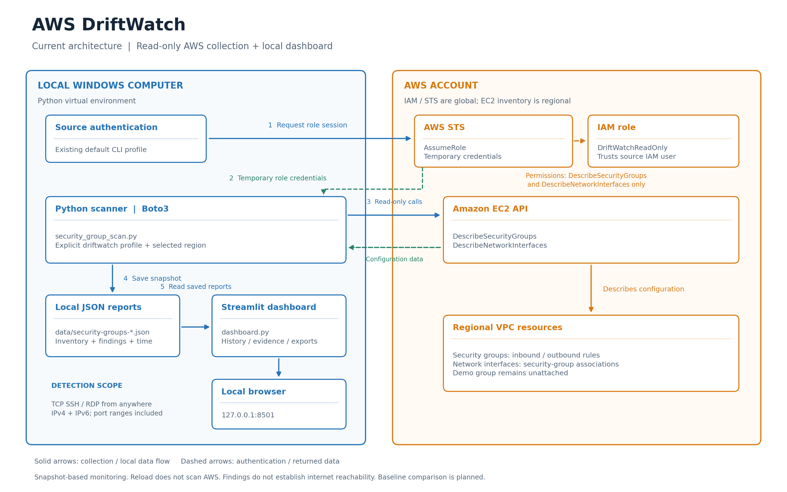
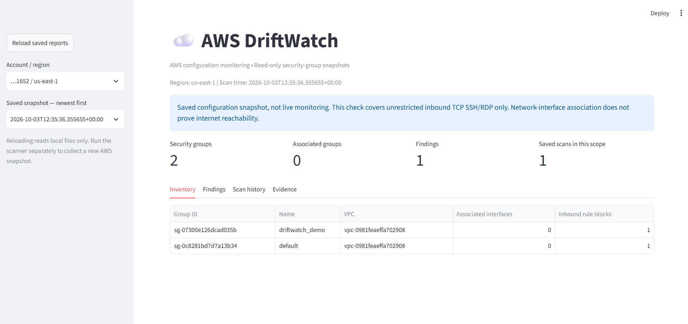
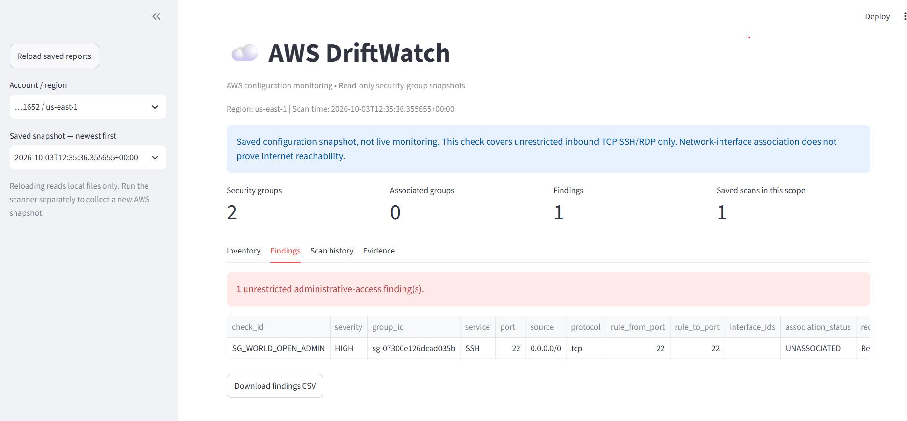
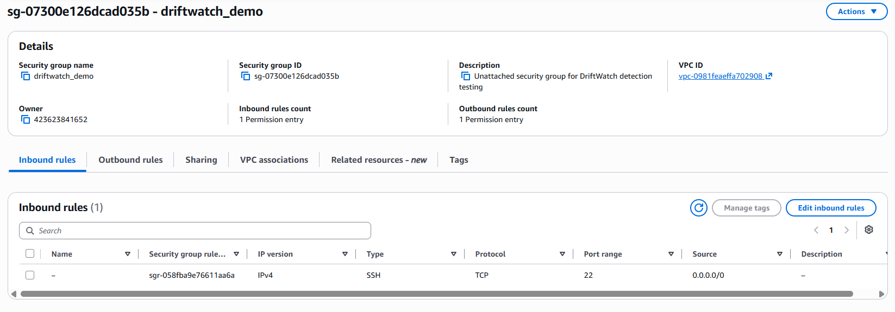
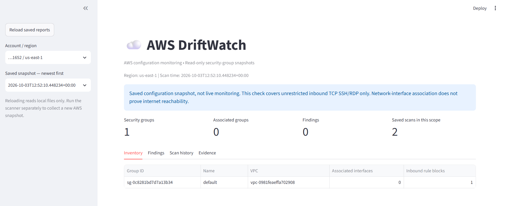
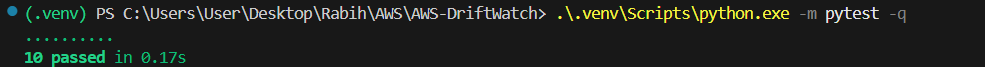

# AWS-DriftWatch

AWS configuration monitoring with a local dashboard, scan history, and security-group findings.

DriftWatch uses a dedicated read-only IAM role to inspect AWS security groups and identify unrestricted inbound SSH/RDP access.

## Architecture



The local scanner assumes a dedicated read-only IAM role, retrieves
security-group configuration and network-interface associations, and
saves timestamped JSON reports. The Streamlit dashboard reads these
reports to display inventory, findings, and scan history.

## Current Features

- Security-group inventory for a selected AWS account and region.
- Detection of unrestricted administrative access:
  - SSH: TCP port 22.
  - RDP: TCP port 3389.
  - IPv4 source: `0.0.0.0/0`.
  - IPv6 source: `::/0`.
  - Port ranges and all-protocol rules that include these services.
- Network-interface associations for each security group.
- Timestamped JSON reports.
- Streamlit dashboard with inventory, findings, scan history, and evidence.
- JSON and findings CSV downloads.
- Automated detector tests.

## Scope and Limitations

- Each scan covers one selected region.
- Findings identify risky configurations, not confirmed internet reachability.
- An associated network interface does not prove that a resource is publicly accessible.
- Zero findings means no matching unrestricted SSH/RDP rules were found.
- The dashboard displays saved snapshots; refreshing it does not perform an AWS scan.
- Failed scans return an error and are not yet stored in scan history.
- Baseline comparison and incident lifecycle tracking are planned.

## Technology Stack

| Component | Technology |
|---|---|
| AWS API access | Python and Boto3 |
| Authentication | AWS CLI role profile and temporary credentials |
| Dashboard | Streamlit |
| Data presentation | Pandas |
| Report storage | Local JSON files |
| Tests | Pytest |
| Version control | Git |

## Project Structure

```text
AWS-DriftWatch/
├── src/
│   └── security_group_scan.py
├── tests/
│   └── test_security_group_scan.py
├── docs/
├── data/                       # Local reports; ignored by Git
├── dashboard.py
├── .gitignore
└── README.md
```

## 1. Verify Prerequisites

Run these commands in PowerShell:

```powershell
py --version
git --version
aws --version
```

These check the installed Python, Git, and AWS CLI versions.

## 2. Prepare the Python Environment

Run from the cloned repository root:

```powershell
py -m venv .venv

.\.venv\Scripts\python.exe -m pip install --upgrade pip
.\.venv\Scripts\python.exe -m pip install boto3 streamlit pandas pytest

New-Item -ItemType Directory -Path src, tests, docs, data -Force
```

The virtual environment isolates project dependencies. Using its Python executable directly avoids needing to activate it.

Verify dependency consistency:

```powershell
.\.venv\Scripts\python.exe -m pip check
```

Expected:

```text
No broken requirements found.
```

## 3. Configure Git Exclusions

Create `.gitignore` at the repository root:

```gitignore
.venv/
__pycache__/
*.py[cod]
.pytest_cache/
.env
.env.*
.aws/
.streamlit/secrets.toml
data/
```

This excludes local environments, credentials, caches, and AWS scan reports.

Verify:

```powershell
git check-ignore .venv/pyvenv.cfg
git status --short
```

Git tracks files rather than empty directories. Optional `.gitkeep` files can preserve empty `src`, `tests`, and `docs` directories.

## 4. Verify Existing AWS Authentication

```powershell
aws configure list-profiles
```

This project's setup used an existing `default` profile.

Check its identity:

```powershell
aws sts get-caller-identity --profile default --query Arn --output text
```

The source identity used during development was an IAM user named `terraform-admin`.

Replace `YOUR_ACCOUNT_ID` and `YOUR_SOURCE_USER` below with your own values.

## 5. Create the Read-Only IAM Policy

In **IAM → Policies → Create policy → JSON**, enter:

```json
{
  "Version": "2012-10-17",
  "Statement": [
    {
      "Sid": "ReadSecurityGroupInventory",
      "Effect": "Allow",
      "Action": [
        "ec2:DescribeSecurityGroups",
        "ec2:DescribeNetworkInterfaces"
      ],
      "Resource": "*"
    }
  ]
}
```

Name the policy:

```text
DriftWatchSecurityGroupReadOnly
```

These operations require `"Resource": "*"` because they do not support resource-level permissions.

## 6. Create the Dedicated Role

In **IAM → Roles → Create role → Custom trust policy**, enter:

```json
{
  "Version": "2012-10-17",
  "Statement": [
    {
      "Effect": "Allow",
      "Principal": {
        "AWS": "arn:aws:iam::YOUR_ACCOUNT_ID:user/YOUR_SOURCE_USER"
      },
      "Action": "sts:AssumeRole"
    }
  ]
}
```

Attach `DriftWatchSecurityGroupReadOnly` and name the role:

```text
DriftWatchReadOnly
```

The trust policy identifies who may assume the role. The attached permissions policy defines what the role can do.

The source identity must be authorized to assume the role. Explicit denies or other account restrictions can still prevent access.

## 7. Configure the DriftWatch Profile

```powershell
aws configure set role_arn arn:aws:iam::YOUR_ACCOUNT_ID:role/DriftWatchReadOnly --profile driftwatch
aws configure set source_profile default --profile driftwatch
aws configure set role_session_name DriftWatchLocal --profile driftwatch
aws configure set output json --profile driftwatch
aws configure set region eu-central-1 --profile driftwatch
```

This profile uses the existing source profile to obtain temporary role credentials. No additional access keys are required.

Verify the role:

```powershell
aws sts get-caller-identity --profile driftwatch --query Arn --output text
```

Expected ARN format:

```text
arn:aws:sts::YOUR_ACCOUNT_ID:assumed-role/DriftWatchReadOnly/DriftWatchLocal
```

Test security-group access:

```powershell
aws ec2 describe-security-groups --profile driftwatch --query "length(SecurityGroups)" --output text
```

## 8. Run the Scanner

Use the profile's configured region:

```powershell
.\.venv\Scripts\python.exe .\src\security_group_scan.py
```

Or specify a region explicitly:

```powershell
.\.venv\Scripts\python.exe .\src\security_group_scan.py --region us-east-1
```

Example output:

```text
Region: us-east-1
Security groups scanned: 2
Findings: 1
[HIGH] sg-example | SSH | 0.0.0.0/0 | UNASSOCIATED
Report saved: ...\data\security-groups-TIMESTAMP.json
```

Reports contain the account, region, scan timestamp, inventory, findings, and assessment limitations.

## 9. Run the Tests

```powershell
.\.venv\Scripts\python.exe -m pytest -q
```

Initial validation result:

```text
10 passed
```

Tests cover unrestricted IPv4 and IPv6 access, port ranges, all-protocol rules, restricted sources, empty rules, and interface-association reporting.

Tests run locally without AWS API calls.

## 10. Launch the Dashboard

```powershell
.\.venv\Scripts\python.exe -m streamlit run .\dashboard.py --server.address 127.0.0.1
```

Open:

```text
http://localhost:8501
```

The dashboard includes:

- Inventory.
- Findings.
- Scan history.
- Original JSON evidence.

To update results:

1. Run the scanner in a second PowerShell window.
2. Click **Reload saved reports**.
3. Select the correct account, region, and snapshot.

Press **Ctrl+C** in the dashboard terminal to stop it.

## Controlled Detection and Recovery Exercise

1. Create an unattached security group named `driftwatch-demo`.
2. Add an inbound SSH rule from `0.0.0.0/0`.
3. Keep the group unattached to instances and network interfaces.
4. Scan the region containing the demo group.
5. Confirm the finding appears in the dashboard.
6. Remove the unrestricted SSH rule.
7. Scan again to verify the finding is absent.
8. Select the earlier snapshot to review the original evidence.

The detection stage was successfully demonstrated during development. Recovery should be confirmed using a subsequent scan.

### Regional Troubleshooting

Security groups are regional resources.

During development, the demo group was created in N. Virginia (`us-east-1`), while the initial scanner configuration used Frankfurt (`eu-central-1`).

Scanning `us-east-1` resolved the apparent missing finding.

## Windows Dependency Troubleshooting

Windows Application Control blocked a compiled Pandas component during dashboard startup.

Installing a different compatible Pandas release resolved the observed issue while Smart App Control remained enabled:

```powershell
.\.venv\Scripts\python.exe -m pip install --no-cache-dir --only-binary=:all: --index-url https://pypi.org/simple "pandas>=2.3,<3"
```

Verify:

```powershell
.\.venv\Scripts\python.exe -c "import pandas; print('Pandas import OK:', pandas.__version__)"
.\.venv\Scripts\python.exe -m pip check
```

This workaround may not resolve every application-control policy block.

## Cost and Security

- The scanner and dashboard run locally.
- No EC2 instance is required for the demo.
- AWS security groups have no additional charge.
- AWS Budgets alerts notify about spending; they do not impose a hard spending limit.
- Credentials and local reports must not be committed.
- Downloaded reports may contain account and resource identifiers.
- DriftWatch currently performs read operations only.

## Project Demonstration

### Dashboard Overview

A saved AWS scan showing security-group inventory and an administrative-access finding.



### Security Finding

DriftWatch detected an inbound rule allowing SSH from any IPv4 address.
The demo security group was unassociated with network interfaces; this
finding identifies risky configuration, not confirmed internet exposure.



### AWS Configuration Evidence

The demo security group's inbound rule permitted TCP port 22 from
`0.0.0.0/0`. The group was kept unattached during the exercise.



### Verified Recovery

After removing the unrestricted SSH rule, a subsequent scan found no
matching unrestricted SSH/RDP rules in the selected region.



### Automated Tests

Ten local tests passed, covering detection behavior and interface-association reporting.



## Roadmap

- Approved configuration baselines.
- Detection of added, removed, and changed configurations.
- Incident lifecycle and verified resolution tracking.
- Persistent failed-scan records.
- Terraform-managed demo resources.
- Additional S3 and IAM checks.
- Architecture documentation and a recorded demonstration.